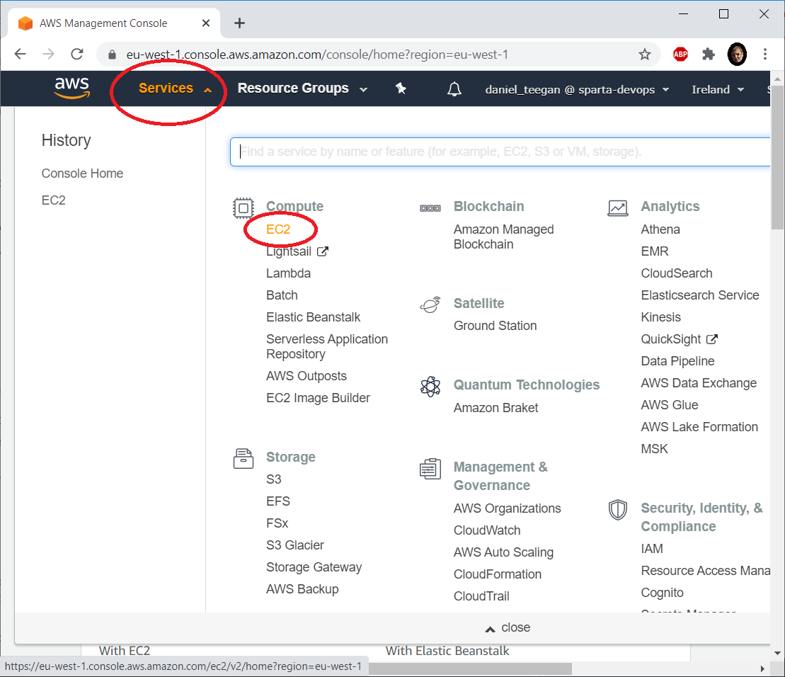

# Running A Node JS Application On An EC2 Instance

####  [Detailed guide](/Detailed-guide.md) for more detail on AWS 

## Prerequisites
- Download [Git Bash](https://git-scm.com/downloads)

Before jumping into AWS, there is some software that needs to be downloaded for this project. Git offer a command line that is designed
to execute on a unix style line environment. Once this is installed, you may begin your journey to AWS and cloud computing

## Creating an EC2 instance
- Given you have created an AWS account, go to the dashboard and click running instances
- Then choose the machine and configurations appropriate to your project. If you are running an individual project, it is 
recommended to run T2 micro machine for cost efficiency. 
 

## Clone the Repository
- Download and extract the zip file and move it to a safe file location
- It is recommended to make a location where all your code is stored*

## Entering Our Cloud Machine and Running Our Application

- The zip folder would have most likely gone to your downloads folder

- Open git bash and locate to the folder where you have saved this cloned repository

1. The following command will run a provision script that would then run the application

        $ ./scp_setup.sh
     
2. Once in the vm, enter the command below to run the provision folder  

        $ ./provision.sh
